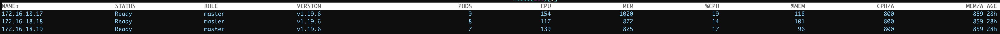
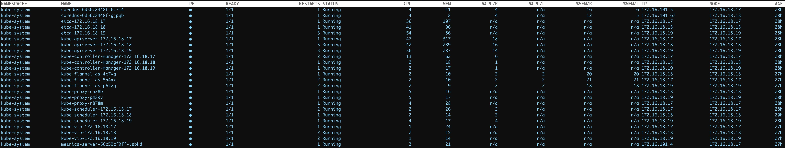

# kok-operator

kok-operator 可以自动化完成高可用 kubernetes 部署

# 特性

- 支持 fake-apiserver、k3s 作为 bootstrap cluster，解决第一次部署集群没有元集群问题
- 云原生架构，crd+controller，采用声明式 api 描述一个集群的生命周期(创建，更新，升级，删除)
- 支持 baremetal 和 managed 两种方式部署集群
- 支持 containerd，并且支持配置 mirrors、私有仓库
- 自动生成集群所有证书，无坑版100年集群证书
- 支持 static pod 容器化部署高可用 etcd 集群，也支持外部 etcd 集群
- 集群组件全部 static pod 容器化部署
- 支持 coredns、kube-proxy、flannel、metrics-server、metallb、contour 等 addons 模板化部署
- 支持 centos、ubuntu、debian 系统
- 支持 helm v3, 多 repo 管理
- 支持多集群管理
- 控制面组件高可用采用 kube-vip+envoy, no keepalived, no haproxy, no nginx

# 安装部署

## 准备

### 下载启动 k3s 集群
```bash
# 下载二进制文件, 进入tools目录
$ cd tools
$ bash https://raw.githubusercontent.com/wtxue/kok-operator/master/tools/centos-k3s-node.sh
```

### Get a kubeconfig by the k3s node ip
```bash
export NodeIP=xx.xx.xx.xx
mkdir -p $HOME/.kube
sudo cat /etc/rancher/k3s/k3s.yaml | sed 's/127.0.0.1/'$NodeIP'/g' > $HOME/.kube/config
sudo chown $(id -u):$(id -g) $HOME/.kube/config
```

## 运行

### 本地运行
```bash
# 指定 kubeconfig 运行
$ go run cmd/admin-controller/main.go ctrl --enable-manager-crds=true -v 4 --kubeconfig={}/k3s-kubeconfig.yaml
``` 

### helm v3 安装运行

```bash
helm upgrade --install kok-operator --create-namespace --namespace kok-system --debug ./charts/kok-operator

kubectl get pod -n kok-system      
NAME                            READY   STATUS    RESTARTS   AGE
kok-operator-6ff65bc44b-hg4nh   1/1     Running   0          31m
```

## 创建集群

### ha-local-cluster 实例
```yaml
apiVersion: devops.k8s.io/v1
kind: Cluster
metadata:
  name: ha-local-cluster
  namespace: ha-local-cluster
  annotations:
    "k8s.io/apply.step": EnsureDeployCni, EnsureMetricsServer
spec:
  tenantID: k8s                  # 集群拥有者租户名称
  displayName: demo              # 集群显示名称
  clusterType: baremetal         # 集群类型， 支持 baremetal、 hosted
  osType: ubuntu                 # 操作系统类型
  criType: containerd            # cri 类型， 目前支持 containerd， 废弃 docker 支持
  version: v1.19.6               # kubernetes version
  networkDevice: ens34           # 网卡名称， 默认 eth0
  clusterCIDR: 172.16.101.0/24   # 集群 pod cidr
  serviceCIDR: 172.16.201.0/24   # 集群 service cidr
  dnsDomain: cluster.local       # 集群域名
  publicAlternativeNames: # 集群 apiserver 域名
    - ha-local.vip.k8s.io
  features:
    ipvs: true                   # kube-proxy 类型，支持 ipvs、iptables
    internalLB: true
    enableMasterSchedule: true   # master 结点是否调度
    ha:
      thirdParty:
        vip: "172.16.18.243"     # 集群 apiserver vip
        vport: 6443
    hooks:
      cniInstall: flannel         # 集群 cni 插件
  properties:
    maxNodePodNum: 64            # 集群结点 pod 数
  machines: # 集群 master 结点
    - ip: 172.16.18.17
      port: 22
      username: root
      password: "123456"
    - ip: 172.16.18.18
      port: 22
      username: root
      password: "123456"
    - ip: 172.16.18.19
      port: 22
      username: root
      password: "123456"
  apiServerExtraArgs: # apiserver 额外参数
    audit-log-maxage: "30"      # apiserver 审计参数等
    audit-log-maxbackup: "3"
    audit-log-maxsize: "100"
    audit-log-truncate-enabled: "true"
    audit-log-path: "/var/log/kubernetes/k8s-audit.log"
  controllerManagerExtraArgs:
    bind-address: "0.0.0.0"
  schedulerExtraArgs:
    bind-address: "0.0.0.0"
  registry: # 镜像仓库 mirrors
    mirrors:
      "docker.io":
        endpoints:
          - "https://yqdzw3p0.mirror.aliyuncs.com"
      "quay.io":
        endpoints:
          - "https://quay.mirrors.ustc.edu.cn"
  upgrade:
    mode: Manual                     # 集群升级模式，支持 Auto、Manual
    strategy: # 集群升级策略
      maxUnready: 0                  # 需要增加结点轮转升级
      drainNodeBeforeUpgrade: true   # 升级结点前 drain 掉
```

### 创建裸金属集群

```bash
# 创建集群cr
$ kubectl apply -f ./manifests/ha-local-cluster.yaml

# 创建集群结点
$ kubectl apply -f ./manifests/ha-local-cluster-node.yaml
```





### 创建托管集群

创建托管集群时，kok-operator 需要运行在 meta 高可用集群上，这里使用集群名为 meta-cluster, 一个 namespace 一个托管集群

```bash
# 创建 etcd 集群
$ kubectl apply -f ./manifests/etcd-statefulset.yaml

# 创建托管集群cr
kubectl apply -f ./manifests/hosted-cluster.yaml

# 创建托管集群结点
kubectl apply -f ./manifests/hosted-cluster-node.yaml
```

# Development

This project uses [Kubebuilder](https://github.com/kubernetes-sigs/kubebuilder)
for CRD API generation.

# 计划

- [x]  打通元集群及托管集群 service 网络，以支持聚合 apiserver
- [x]  集群升级支持
